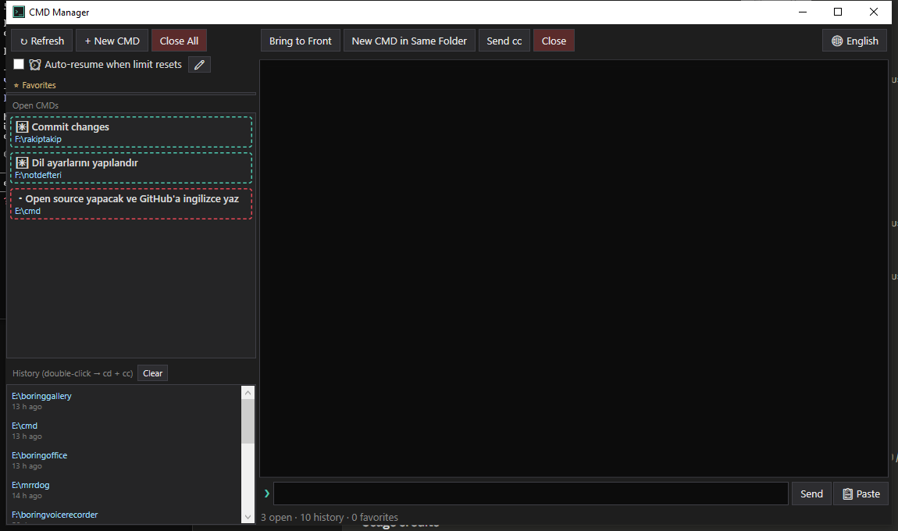

# CmdManager

A Windows WPF utility for monitoring and remote-controlling `cmd.exe` windows that run [Claude Code](https://claude.com/claude-code) sessions. It watches every open cmd window on selected drives, shows a live colored preview of the selected console, and lets you drive sessions without ever touching the windows themselves.

  

> **Not affiliated with Anthropic.** This is an independent, third-party tool. "Claude" and "Claude Code" are trademarks of Anthropic; this project is not endorsed by or connected to Anthropic in any way.



## Features

- **Live console preview** — reads the target console's screen buffer (colors included) and renders it in the app; no focus stealing.
- **Busy/idle indicators** — each cmd gets a red (working) or teal (idle) border by watching screen-buffer changes; a beep fires when a command you sent finishes.
- **Silent input** — type a command in the app and it's injected straight into the target console via `WriteConsoleInput`; Up/Down cycles your recently sent commands, and a clipboard-paste fallback handles long text. Unicode (including Turkish characters) is preserved end to end.
- **One-click session actions** — send `cc` to (re)start Claude Code in a window, switch a console to UTF-8 (`chcp 65001`), clone a cmd in the same directory, or close all tracked windows at once.
- **Auto-resume on usage limits** — when Claude Code stops with "5-hour limit reached · resets 3pm" (or weekly / extra-usage variants), the app parses the reset time off the screen and automatically sends a configurable resume command (default `devam et`) once the limit lifts. It's heavily guarded against false positives: on-screen code/quotes don't trigger it, it won't type into a bare shell after Claude has exited, and it postpones if you're actively using that window. Toggle it and edit the message from the toolbar.
- **History & favorites** — directories of closed cmds are recorded automatically (double-click to reopen and relaunch `cc`); pin favorite directories with custom labels.
- **Global hotkey** — `Ctrl+Alt+M` toggles the window from anywhere.
- **English / Turkish UI** — ships in English by default; switch to Turkish anytime with the 🌐 button (your choice is saved to settings).

## Build

```
dotnet build -c Release
```

Publish a single-file exe:

```
dotnet publish -c Release -r win-x64 --self-contained false -p:PublishSingleFile=true -o publish
```

> The app intentionally keeps running after its window is closed, which locks the exe — kill `CmdManager` from Task Manager before rebuilding.

## Requirements

- Windows 10/11, **x64**
- .NET 8 Desktop Runtime
- Runs elevated (`requireAdministrator`) — see [Security & admin rights](#security--admin-rights) below
- A `cc` command on `PATH` that launches Claude Code (the "open + cc" actions run it)

## Security & admin rights

CmdManager requests administrator rights (the UAC prompt on every launch) for two reasons only:

- **`ReadProcessMemory` / `NtQueryInformationProcess`** — to read another cmd's current working directory out of its PEB.
- **`AttachConsole`** — to read and write other processes' console screen buffers.

It runs entirely locally, makes **no network connections**, and stores nothing outside `%APPDATA%\CmdManager\`. The full source is in this repository — please audit it before running an elevated binary. See [SECURITY.md](SECURITY.md) for how to report a vulnerability.

## Known limitations

- **x64 only.** Working-directory discovery reads the target process's PEB using hardcoded x64 offsets; an x86 build would read the wrong memory. These offsets track current Windows builds and could break on a future Windows version.
- Only cmd windows whose current directory is on the drives listed in `AllowedDrives` (`MainWindow.xaml.cs`, default `E:` and `F:`) are shown — adjust to taste.
- Console attachment is process-wide state, so all cross-process console reads/writes run serialized on the UI thread.

## Notes

- Settings, history (capped at 100 entries) and favorites live under `%APPDATA%\CmdManager\` as JSON.
- New cmds start with `/K chcp 65001 >nul` (UTF-8); the "open + cc" variants then `cd /d "<path>" && cc`.

## Contributing

Issues and PRs are welcome, but this is a personal tool — responses may be slow. To hack on it, run `dotnet build -c Release`, and remember to kill any running `CmdManager` process before rebuilding.

## License

[MIT](LICENSE) © minerd
